# SSH Brute-Force Detection Lab with Wazuh SIEM

A hands-on security monitoring lab that simulates a real-world SSH brute-force attack and demonstrates end-to-end detection, analysis, and automated response using **Wazuh** as the SIEM/XDR platform and **Kali Linux** as the attacker machine.

  

---

## Table of Contents

1. [Introduction](#1-introduction)
2. [Lab Setup](#2-lab-setup)
3. [Installation Steps](#3-installation-steps)
4. [Attack Simulation](#4-attack-simulation)
5. [Detection Analysis](#5-detection-analysis)
6. [MITRE ATT&CK Mapping](#6-mitre-attck-mapping)
7. [Active Response (Optional)](#7-active-response-optional)
8. [Conclusion](#8-conclusion)

---

## 1. Introduction

### What is Wazuh?

[Wazuh](https://wazuh.com) is a free, open-source SIEM (Security Information and Event Management) and XDR platform. It collects, indexes, and analyzes log data from servers and endpoints through a lightweight agent, applies a rule-based detection engine, and surfaces the results through a centralized dashboard. Wazuh ships with built-in detection rules for common attack patterns (including SSH brute-force), maps alerts to the **MITRE ATT&CK** framework, and supports **active response** scripts that can automatically remediate threats (e.g., blocking an attacker's IP).

### What is Kali Linux?

[Kali Linux](https://www.kali.org) is a Debian-based distribution purpose-built for penetration testing and offensive security work. It ships pre-loaded with tools such as **Hydra**, **Nmap**, **Metasploit**, and the **rockyou.txt** password list, making it the natural choice for simulating realistic attacks in a controlled lab environment.

### Project Goal

The goal of this project is to build a small but complete detection-and-response pipeline:

1. Stand up a Wazuh manager monitoring an Ubuntu SSH server.
2. Launch a real SSH brute-force attack from Kali using Hydra and `rockyou.txt`.
3. Confirm that Wazuh automatically detects the attack pattern, generates alerts, and maps them to MITRE ATT&CK technique **T1110 (Brute Force)**.
4. Configure and validate an **active response** rule that automatically blocks the attacking IP via the host firewall.

---

## 2. Lab Setup

### Environment

| Component | Role | OS | Notes |
|---|---|---|---|
| Wazuh Manager + Indexer + Dashboard | SIEM / monitored target | Ubuntu 24.04 LTS (aarch64) | SSH (`sshd`) enabled and exposed |
| Kali Linux | Attacker + Wazuh Agent | Kali Linux 2025.2 (arm64) | Hydra v9.5, `rockyou.txt` |

Both machines run as Parallels Desktop virtual machines on Apple Silicon, bridged on the same private virtual network.

### Network Diagram

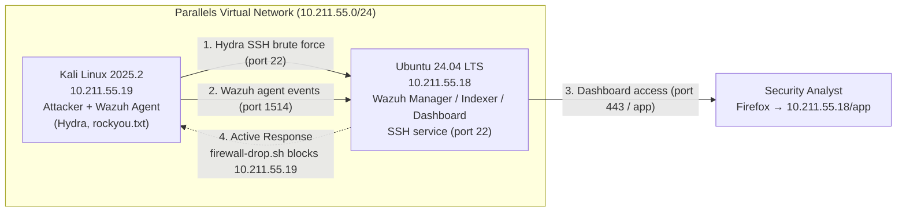
```mermaid
graph LR
    subgraph "Parallels Virtual Network (10.211.55.0/24)"
        A["Kali Linux 2025.2<br/>10.211.55.19<br/>Attacker + Wazuh Agent<br/>(Hydra, rockyou.txt)"]
        B["Ubuntu 24.04 LTS<br/>10.211.55.18<br/>Wazuh Manager / Indexer / Dashboard<br/>SSH service (port 22)"]
    end
    A -- "1. Hydra SSH brute force (port 22)" --> B
    A -- "2. Wazuh agent events (port 1514)" --> B
    B -- "3. Dashboard access (port 443 / app)" --> Analyst["Security Analyst<br/>Firefox → 10.211.55.18/app"]
    B -. "4. Active Response<br/>firewall-drop.sh blocks 10.211.55.19" .-> A
```

| Direction | Port | Purpose |
|---|---|---|
| Kali → Ubuntu | 22/tcp | SSH brute-force attack (Hydra) |
| Kali (agent) → Ubuntu (manager) | 1514/tcp | Wazuh agent → manager event forwarding |
| Analyst → Ubuntu | 443 / app | Wazuh dashboard (Kibana-based UI) |
| Ubuntu → Kali | n/a | Active response: local `iptables`/firewall block of attacker IP |

---

## 3. Installation Steps

### 3.1 Wazuh Manager (Ubuntu)

The Wazuh all-in-one stack (manager, indexer, dashboard) was deployed on the Ubuntu VM. Once running, the dashboard was reachable in the browser at `https://10.211.55.18/app/login`.

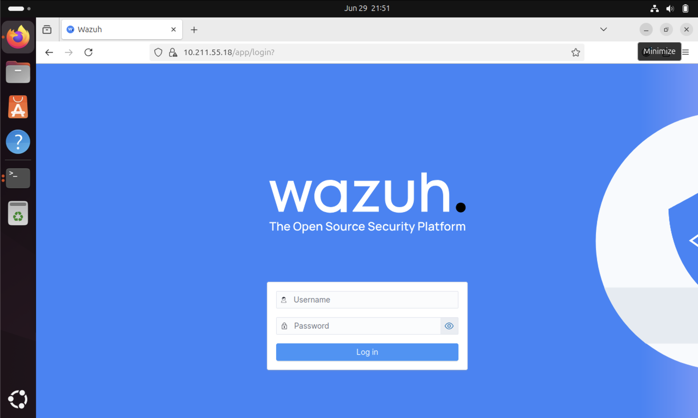
*Wazuh dashboard login screen on first access.*

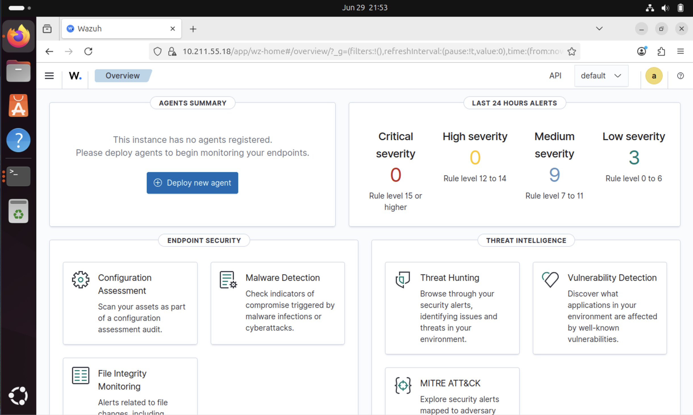
*Fresh Wazuh dashboard — Overview page shows 0 agents registered before the Kali agent is deployed.*

`sshd` was enabled and started on the Ubuntu manager so it could act as the brute-force target:

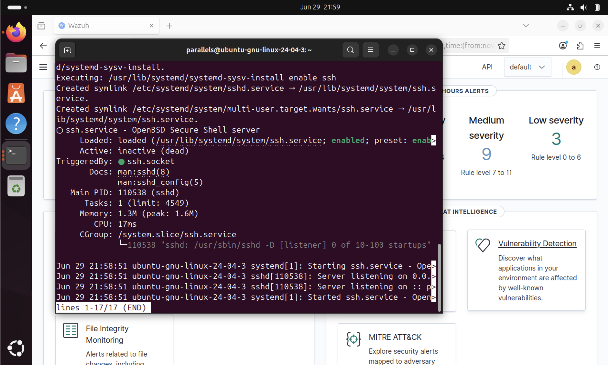
*`systemctl enable/start ssh` — OpenSSH server listening on port 22.*

The manager's IP address was confirmed via `ip a`:

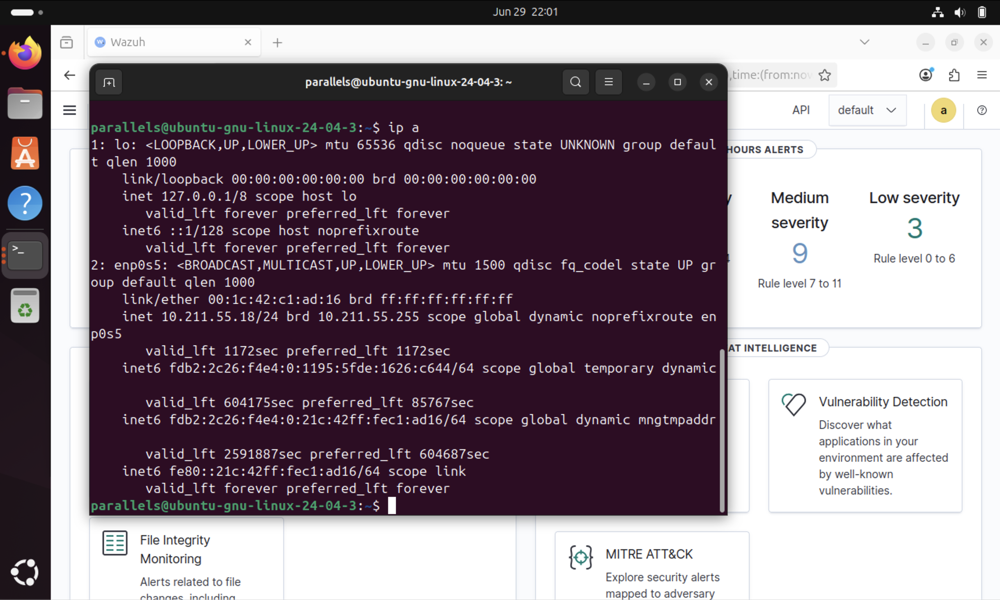
*Ubuntu manager bound to `10.211.55.18` on the Parallels shared network adapter.*

### 3.2 Wazuh Agent (Kali Linux)

The Wazuh agent package (`wazuh-agent_4.9.2-1_arm64.deb`) was downloaded directly from `packages.wazuh.com` on the Kali VM and installed with the manager IP and a custom agent name baked in:

```bash
sudo WAZUH_MANAGER="10.211.55.18" WAZUH_AGENT_NAME="kali-agent" \
  dpkg -i ./wazuh-agent_4.9.2-1_arm64.deb

sudo systemctl enable wazuh-agent
sudo systemctl start wazuh-agent
```

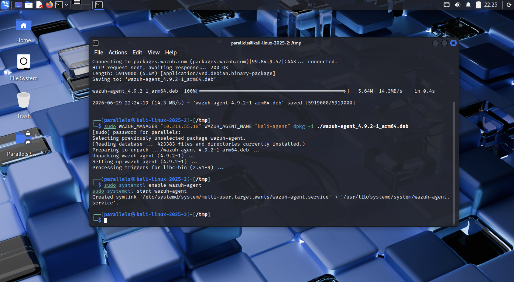
*Agent package downloaded and installed on Kali, pointed at manager `10.211.55.18`.*

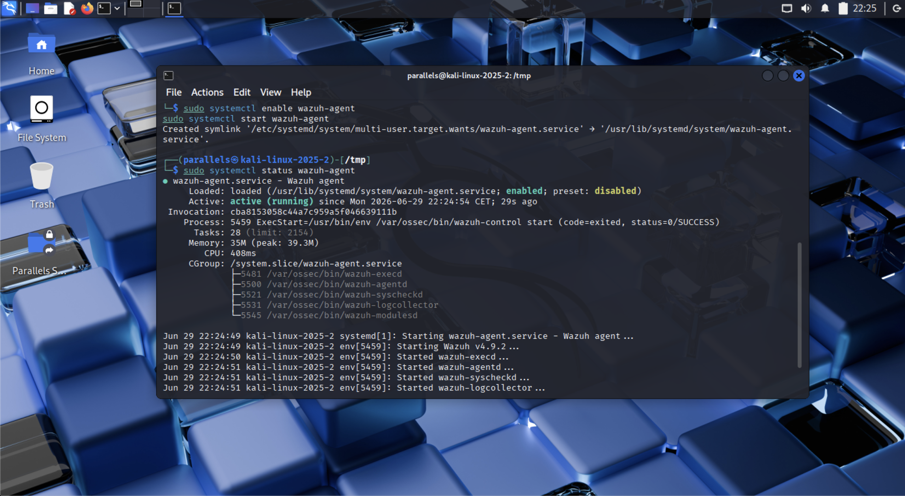
*`systemctl status wazuh-agent` confirms the agent is `active (running)`, with `wazuh-agentd`, `wazuh-syscheckd`, and `wazuh-logcollector` child processes started.*

Once the agent connected, the dashboard immediately reflected it:

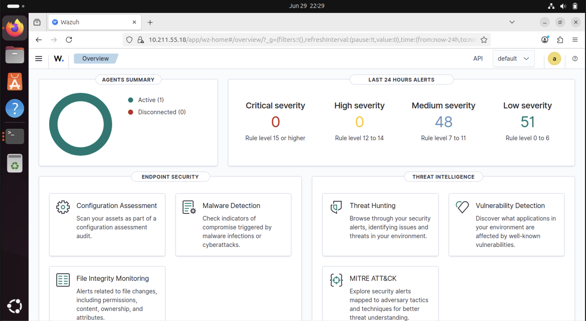
*Agents Summary now shows 1 Active agent (`kali-agent`), and the Last 24 Hours Alerts panel begins populating with baseline activity.*

---

## 4. Attack Simulation

### 4.1 Tooling preparation

Hydra's version was confirmed and the `rockyou.txt` wordlist (bundled with Kali, normally gzip-compressed) was decompressed for use:

```bash
hydra -version
cd /usr/share/wordlists/
sudo gunzip rockyou.txt.gz
```

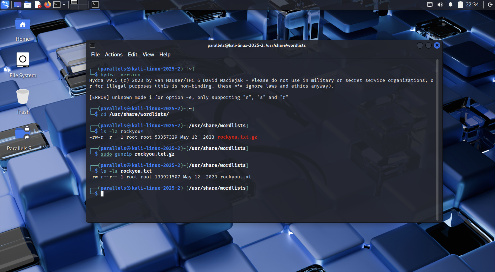
*Hydra v9.5 confirmed; `rockyou.txt` (≈14.3M candidate passwords, 139 MB) decompressed and ready.*

Basic SSH reachability between the two VMs was verified manually before the automated attack:

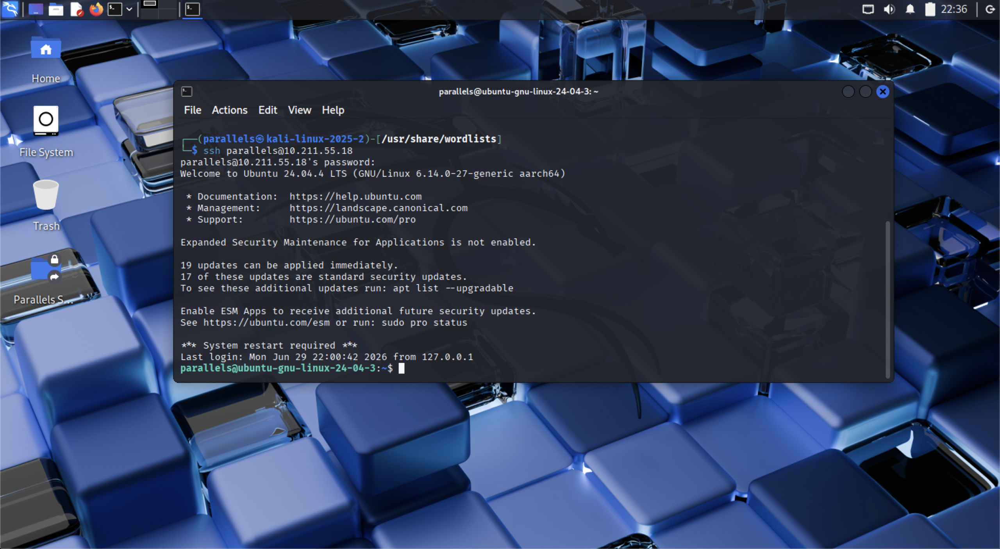
*Manual `ssh parallels@10.211.55.18` from Kali confirms SSH connectivity and successful authentication to the Ubuntu target.*

### 4.2 Launching the Hydra attack

The brute-force attack targeted the `parallels` account on the Ubuntu SSH service using the full `rockyou.txt` wordlist:

```bash
hydra -l parallels -P /usr/share/wordlists/rockyou.txt ssh://10.211.55.18
```

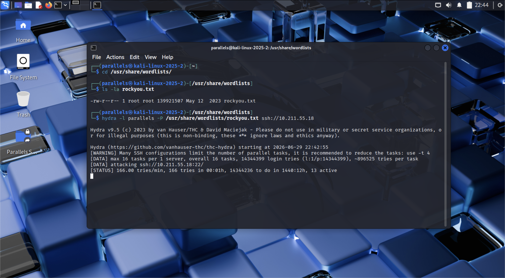
*Hydra begins attacking `ssh://10.211.55.18:22`, with ~14.3 million login attempts queued (`l:1/p:14344399`) at an initial rate of ~166 tries/minute across 13–16 parallel tasks.*

Hydra's SSH module is intentionally throttled by the protocol and by Wazuh/SSH's own connection limits, so the run was throughput-limited and eventually self-terminated after triggering "too many connection errors" on the target — itself a side effect of the brute-force traffic being detected and slowed down:

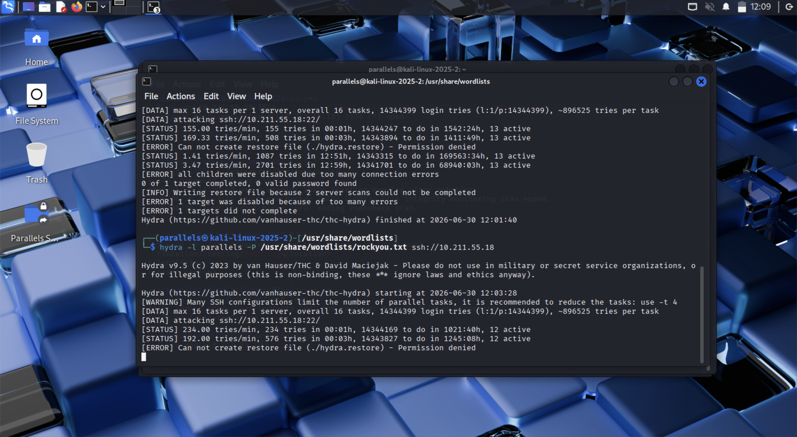
*Hydra log showing the attack progressing over multiple sessions (~1,000–2,700+ tries), eventually disabled due to excessive connection errors from the target — consistent with the SSH daemon rejecting the flood of failed logins.*

> **Note:** No valid credentials were found (`rockyou.txt` does not contain the actual account password), which is expected — the objective of this lab is to validate *detection*, not to actually compromise the target.

---

## 5. Detection Analysis

### 5.1 Baseline (pre-attack)

Before the attack, the **Threat Hunting** dashboard showed a quiet baseline: a handful of legitimate authentication events and no brute-force indicators.

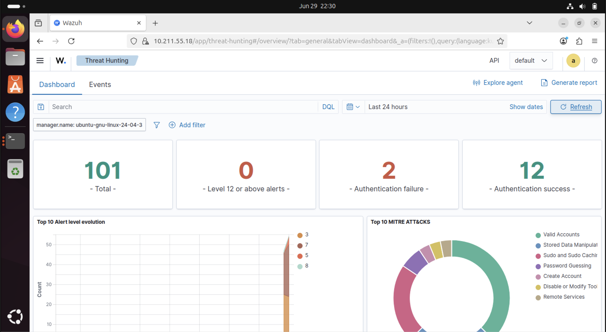
*Baseline state: 101 total events in the last 24h, only 2 authentication failures and 12 successful logins — no brute-force pattern yet.*

Filtering specifically on the `kali-agent`, the **MITRE ATT&CK** donut chart already begins to show "Password Guessing" and "Disable or Modify Tools" entries as the environment is prepared:

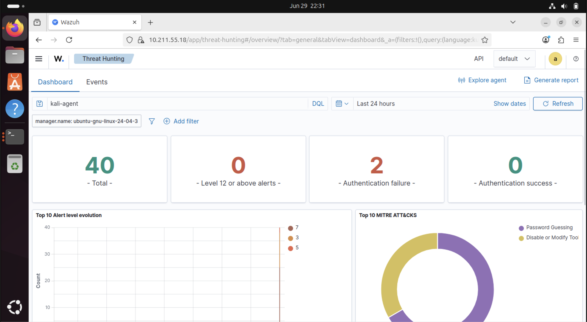
*Filtered view scoped to the Kali agent, showing early Password Guessing activity tied to MITRE ATT&CK.*

### 5.2 Alert flood during the attack

As soon as Hydra started hammering the SSH service, the **Threat Hunting → Events** view lit up with a continuous stream of `sshd: authentication failed` events, interspersed with higher-severity correlation rules:

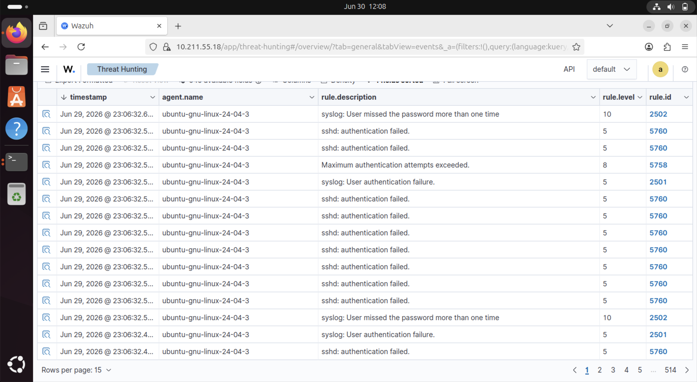
*Raw event stream: dozens of `sshd: authentication failed` (rule 5760, level 5) events per second, alongside `Maximum authentication attempts exceeded` (rule 5758, level 8) and `syslog: User authentication failure` (rule 2501).*

### 5.3 Brute-force correlation rules (5710 / 5712 / 5763)

Wazuh's `sshd` ruleset doesn't just log individual failed logins — it correlates repeated failures from the same source into dedicated **brute-force** alerts. Filtering the Events view on the three correlation rule IDs specified for this lab confirms the detection fired as expected:

```
rule.id:5710 OR rule.id:5712 OR rule.id:5763
```

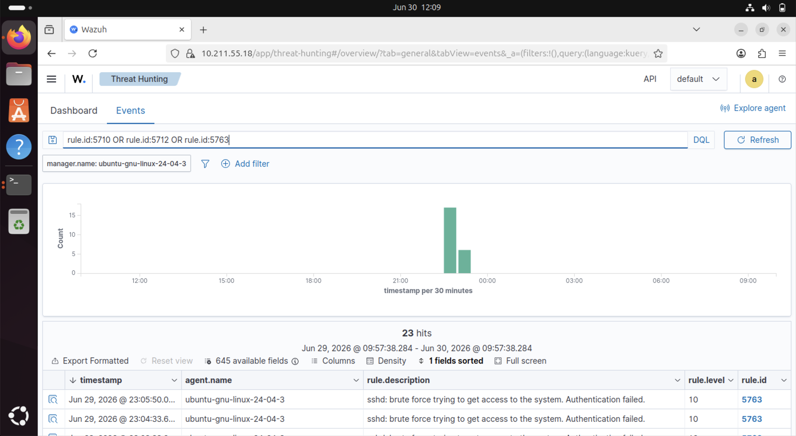
*Filtered query for rules 5710/5712/5763 returns 23 hits, with a clear timeline histogram showing two clusters of brute-force activity around 23:00–23:30 (matching the Hydra run windows).*


*Full alert table: repeated `sshd: brute force trying to get access to the system. Authentication failed.` entries, rule 5763, severity level 10 — Wazuh's highest-confidence brute-force signature.*

### 5.4 Drilling into a single alert

Expanding an individual rule 5763 alert's **Document Details** reveals the full forensic context Wazuh captured automatically:

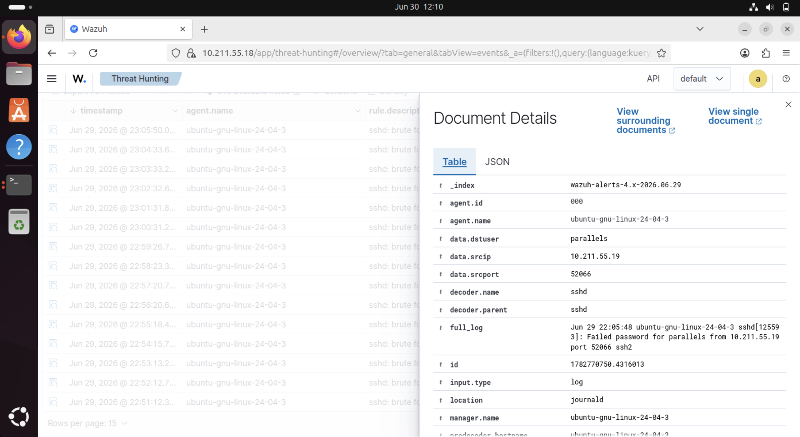
*Key fields: `data.srcip: 10.211.55.19` (the Kali attacker), `data.dstuser: parallels` (the targeted account), `data.srcport`, and the raw `full_log` line: `Failed password for parallels from 10.211.55.19 port 52066 ssh2`.*

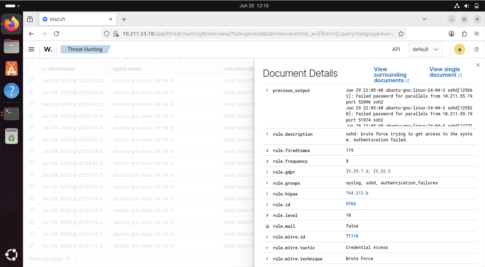
*Scrolling further down the same alert: `rule.id: 5763`, `rule.level: 10`, `rule.frequency: 8` (8 failed attempts triggered the correlation), and — critically — `rule.mitre.id: T1110`, `rule.mitre.tactic: Credential Access`, `rule.mitre.technique: Brute Force`.*

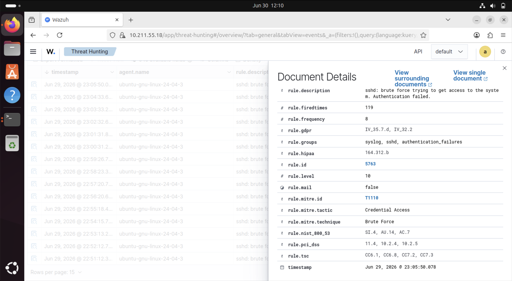
*Wazuh also auto-tags the alert against compliance frameworks: GDPR (IV_35.7.d, IV_32.2), HIPAA (164.312.b), NIST 800-53 (SI.4, AU.14, AC.7), PCI DSS (11.4, 10.2.4, 10.2.5), and TSC (CC6.1, CC6.8, CC7.2, CC7.3) — useful context for GRC reporting.*

---

## 6. MITRE ATT&CK Mapping

| Field | Value |
|---|---|
| **Tactic** | Credential Access |
| **Technique** | T1110 – Brute Force |
| **Wazuh rule IDs** | 5710, 5712, 5763 (correlation/brute-force), with supporting rules 5758, 5760, 2501, 2502 |
| **Rule severity** | Level 10 (high) for confirmed brute-force correlation |
| **Source** | `10.211.55.19` (Kali Linux attacker) |
| **Target** | `10.211.55.18:22` (Ubuntu `sshd`), account `parallels` |

[T1110 – Brute Force](https://attack.mitre.org/techniques/T1110/) covers adversaries attempting to gain access to accounts by systematically guessing passwords. Wazuh natively maps its `sshd` failed-login correlation rules to this technique, which is what allowed the Threat Hunting dashboard's MITRE ATT&CK panel to surface this attack without any custom rule-writing.

---

## 7. Active Response (Optional)

To close the loop from *detection* to *automated remediation*, Wazuh's built-in `firewall-drop` active response was enabled on the manager so that any source IP triggering rules 5710, 5712, or 5763 gets automatically blocked for a configurable timeout.

### 7.1 Configuration

`/var/ossec/etc/ossec.conf` was edited on the manager to register the command and bind it to the brute-force rules:

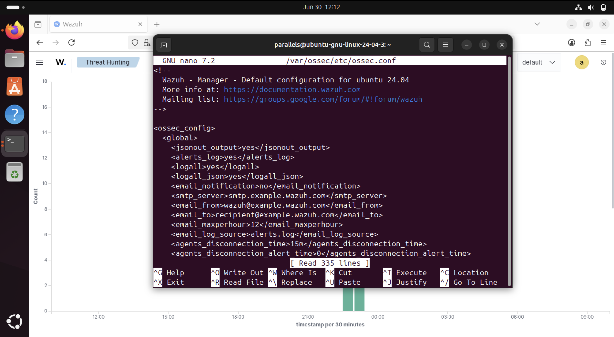
*Opening `/var/ossec/etc/ossec.conf` with `nano` on the Wazuh manager to add the active response block.*

```xml
<command>
  <name>firewall-drop</name>
  <executable>firewall-drop.sh</executable>
  <timeout_allowed>yes</timeout_allowed>
</command>

<active-response>
  <command>firewall-drop</command>
  <location>local</location>
  <rules_id>5710,5712,5763</rules_id>
  <timeout>300</timeout>
</active-response>
```

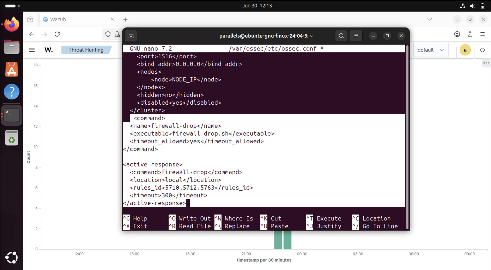
*Final `<active-response>` block: triggers the built-in `firewall-drop` script for rules 5710/5712/5763, blocking the offending IP via local firewall rules for 300 seconds (5 minutes).*

The manager was restarted to apply the new configuration:

```bash
sudo systemctl restart wazuh-manager
```

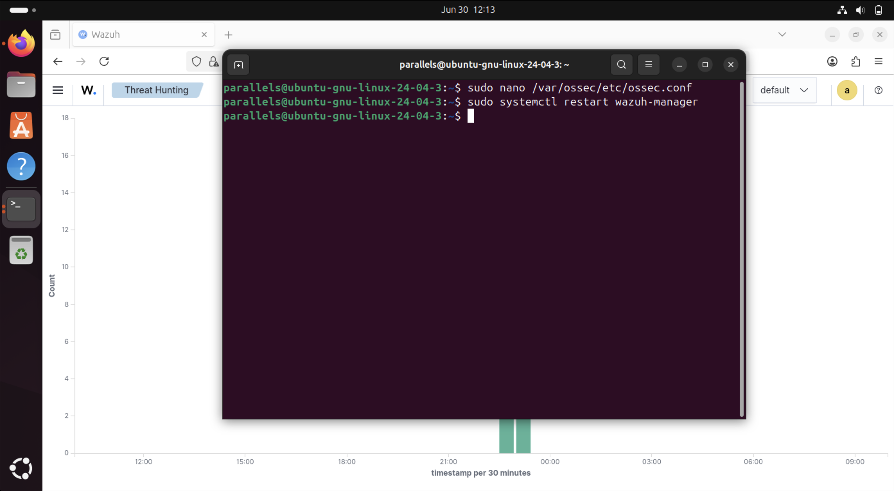
*Manager service restarted to load the active response rule.*

### 7.2 Validating the automated block

With active response enabled, the Hydra attack was re-run. The Events feed confirmed the manager came back online and resumed processing:

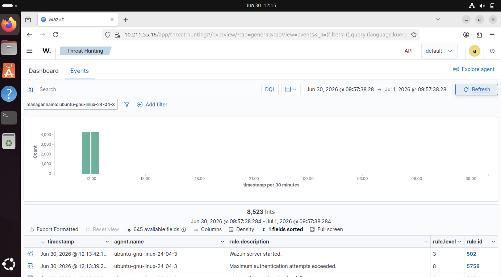
*Post-restart event stream: `Wazuh server started` (rule 502) followed almost immediately by `Maximum authentication attempts exceeded` (rule 5758) as the renewed Hydra run hit the target again.*

Critically, a new alert type appeared in the stream — direct proof the active response fired:

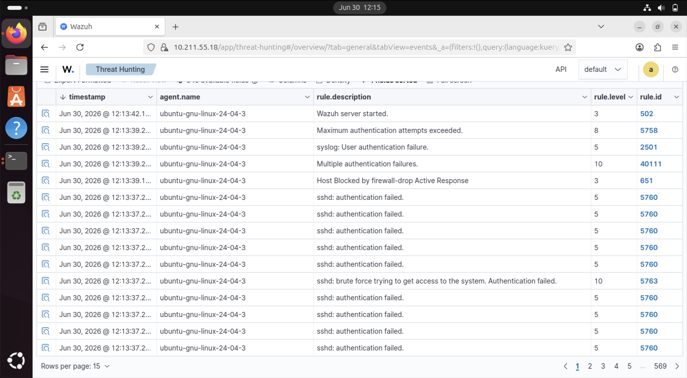
*`Host Blocked by firewall-drop Active Response` (rule 651) — Wazuh automatically invoked the firewall-drop script and blocked the attacking host after the brute-force correlation rule triggered.*

The same `rule.id:5710 OR rule.id:5712 OR rule.id:5763` filter was re-applied to confirm the brute-force detections that triggered the block:

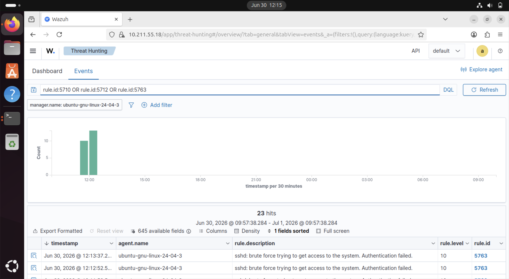
*23 fresh hits on the brute-force rules during the second Hydra run, confirming consistent detection behavior.*

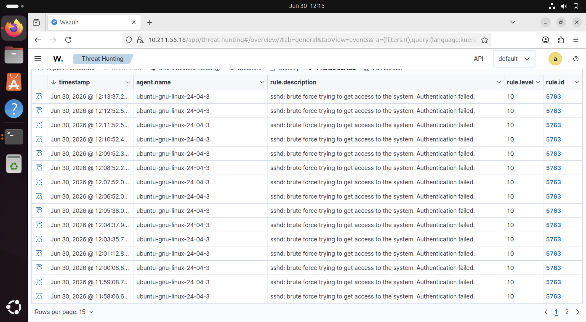
*Alert table for the second run — same `sshd: brute force trying to get access to the system` (rule 5763, level 10) pattern, this time followed by the automatic firewall block.*

After the configured 300-second timeout elapsed, Wazuh's active response automatically removes the firewall rule, restoring connectivity — providing temporary, self-healing containment rather than a permanent block that would require manual cleanup.

---

## 8. Conclusion

### What I learned

- How a production-style **Wazuh manager/agent architecture** is deployed and how agents register and stream events back to the manager (`wazuh-agentd`, `wazuh-syscheckd`, `wazuh-logcollector`).
- How Wazuh's **rule correlation engine** distinguishes a single failed login from a genuine brute-force pattern (rules 5760 → 5758 → 5763), and how severity levels escalate accordingly.
- How alerts are automatically enriched with **MITRE ATT&CK** tactic/technique data and multiple **compliance framework** mappings (GDPR, HIPAA, NIST 800-53, PCI DSS, TSC) without any manual tagging.
- How to configure and validate a Wazuh **active response** integration (`firewall-drop`) end-to-end, including the XML schema for `<command>` and `<active-response>` blocks and the importance of `rules_id` and `timeout` tuning.
- Practical experience running an actual **Hydra** SSH brute-force against `rockyou.txt`, including its real-world rate limits and failure modes (connection-error throttling) when a target environment pushes back.

### Challenges faced

- Running an **ARM64** lab stack (Apple Silicon hosts via Parallels) required ARM-specific Wazuh agent and Hydra builds; some standard SIEM tooling (e.g., Splunk Enterprise) does not support ARM natively, which made Wazuh the practical choice for this environment.
- Hydra's SSH module is inherently rate-limited by SSH's own connection-handling behavior, so achieving a sustained high-volume brute-force required multiple attack runs and patience — useful insight into how real attackers are similarly throttled (and a partial natural defense in itself).
- Getting the `active-response` XML block exactly right (correct `rules_id` list, valid `timeout`, restarting the manager rather than just the agent) took a couple of iterations before the `Host Blocked by firewall-drop Active Response` alert appeared.

### Outcome

The lab successfully demonstrates a complete, realistic detection-and-response workflow: an attacker-side brute-force tool generates real network traffic, a SIEM correlates the resulting failed logins into a high-confidence alert mapped to MITRE ATT&CK T1110, and an automated active response contains the threat — all without any manual intervention once configured.

---

## Repository Structure

```
.
├── README.md
└── screenshots/
    ├── 01-setup/                     # Wazuh manager + agent installation
    ├── 02-attack-simulation/         # Hydra / rockyou.txt SSH brute-force
    ├── 03-detection-analysis/        # Wazuh alerts, rule correlation, MITRE mapping
    └── 04-active-response/           # firewall-drop active response configuration & validation
```

## Tech Stack

- **Wazuh 4.9.2** (Manager, Indexer, Dashboard)
- **Ubuntu 24.04 LTS** (aarch64) — monitored SSH target
- **Kali Linux 2025.2** (arm64) — attacker + Wazuh agent
- **Hydra v9.5** — SSH brute-force tool
- **rockyou.txt** — password wordlist

